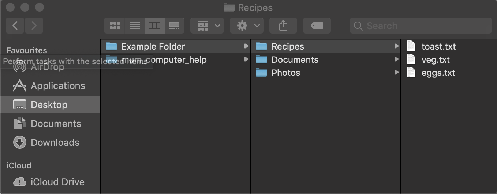
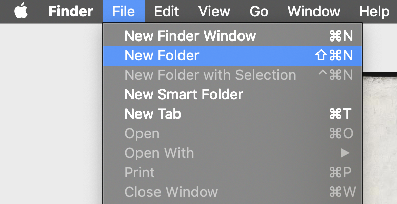
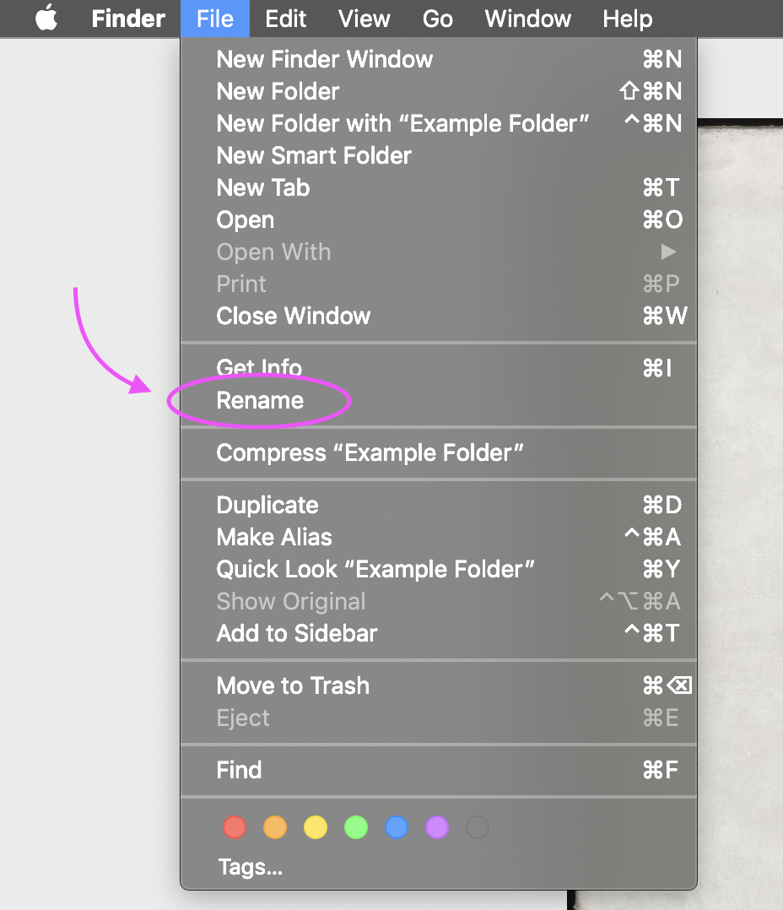
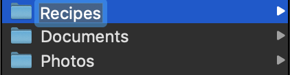
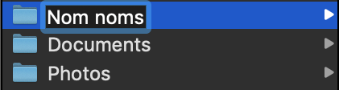

# HOW TO USE YOUR COMPUTER - WITHOUT FREAKING OUT

## Table of Contents

### General Use  
- [Finder is Your Friend :smile:](#finder-is-your-friend)  
- [Creating / Naming / Moving / Copying / Deleting Files and Folders :books:](#creating--naming--moving--copying--deleting-files-and-folders)  
- [Creating Folders :file_folder:](#creating-folders)  
- [Naming Files and Folders :pencil:](#naming-files-and-folders)  

# General Use

## Finder is Your Friend 

- The finder is the gatekeeper to the rest of your computer. Whatever it is 
  you want to get to you can get to it from here.
- It can show you the 'path' of any directory/file. Just think of it like a
  trail of sweets from you home out into the unknown depths of the woods,
  you'll always be able to find your way back again!
- To make navigation a little easier I recommend setting the item viewer of
  your finder window to the columns as you can easily see what sub-folder 
  you are in and the parent folders that you have navigated through.  
  
  

- Spend some time clicking on different folders(directories) and seeing
  where they take you. Get used to how folders are structured. You can always
  click your way back to the directories before - remember the sweets!

  

- Notice how the path through the file structure is made clear by each
  folder being highlighted. Also, you can quickly find out which
  folder you are currently in by looking at the top of the finder
  window - there you find a folder icon with the name of the folder you
  are currently inside.
- If you know the name of the folder or file that you are looking for
  but can't locate it manually you can always search for it via the
  search bar in the top left of the finder window. This will search
  your whole computer and will accept more "human friendly" type
  searching similar to how you would use Google e.g. if you wanted to
  find a photo and you knew the year it was taken then you could start
  by inputing "photos 2003" or "pictures 2003". Experiment with word
  combinations, you might get lucky!

## Creating / Naming / Moving / Copying / Deleting Files and Folders

  - First of all, don't be scared of doing any of these things!

  - To be able to do most tasks on your computer you only need to know
    two things - things which you're already proficient at, as you do
    them every day - **clicking and dragging**. With just these two things
    you can accomplish almost anything.

## Creating Folders
There are **3 ways to create a new folder**
1. With the finder window open click on the tasks selector icon -
   located at the top middle of the finder window - and then select
   'new folder' from the drop-down menu.  
   [finder_task_selector](./help_images/finder_tasks_selector.png)

2. With finder selected, navigate to File in the top toolbar (top of
   the screen) click it and then click 'New Folder' from the drop-down
   menu.  

   

3. As long as it says 'Finder' next to the Apple logo in the top left
   of your screen (signifying that you are using finder) then you can
   use the keyboard shortcut to create a new folder. Soon you'll be
   using shortcuts like a pro! If you were looking carefully you may
   have noticed that to the right of 'New Folder' - when you selected
   'File' from the toolbar in method 2 that - there where three
   keyboard symbols next to each other. What do they mean? Well this
   is another way that finder is being helpful. Next to many common
   commands found in these drop-down menus will be the relative
   keyboard "shortcut", meaning with just three keystrokes (or however
   many it tells you to use) you can quickly complete tasks without
   having to navigate to the appropriate menu / submenu. In short, you
   get stuff done quicker and the more you use them they soon become
   second nature - you'll be suprised by just how much you use them!

   So to use this shortcut press the 'shift' key (the one with the
   arrow pointing up - below the enter key) while at the same time
   pressing the 'command key' and 'N.  

   

## Naming Files and Folders

With most tasks on a computer - or any other task in life for that
matter - there are many ways of going about doing the task, with the
result being the same. So, like the creating of a new folder, there are
many ways to name a folder or file. As a side note: hopefully you will
begin to see a pattern emerging with all these commands. You will find
yourself going to the same menus and using the same keystrokes and
clicking patterns to complete tasks.  

The designers of these operating systems want it to be as easy as possible for
you to remember how to accomplish the tasks you want, so finding a common
language to do these tasks is part of it's inherent design philosophy -
basically have a look around, most things are clearly signposted or a few
clicks away if you just take the time to look and click on a few things, you
can't do anything wrong!  

Although there are many ways to get to the same result I would recommend using
the mouse and clicking through the menus, the 'shortcuts', though powerful, my
just be confusing and hurt your brain if you try memorising them all!  

So what were we doing again ... Ah yes, naming folders, let's do it!

1. Let's start with the trusty old toolbar at the top of your screen. You know
   it has it's uses! So, first thing is make sure you are in your Finder and you
   have a folder in front of you that you want to change the name of. **Make sure
   the you have selected it**, so that the line it is on or general highlighting
   around it is *blue* (this colour my change depending on your settings but
   assuming you haven't changed anything yours should default to blue).  

   With your folder selected, click 'Edit' in the toolbar at the top of your
   screen. 

   About halfway down the list you should see a heading that says 'Rename'. This
   should be highlighted white if you have a folder selected properly or will be
   grayed out and disabled if not.  

     
   *Renaming using the toolbar*  

   Select 'Rename', your folder name will be highlighted differently now, you
   can start typing and then hit return and the folder will be renamed!  

    
   *Folder highlighted ready to be renamed*  

     
   *Folder renamed!*  

2. We will next rename a folder using the finder window. Just like we did when
   we were creating a file we need to click on the tasks selector icon. From
   here we will get a menu of actions similar to what we had when we selected
   using the toolbar in the previous method.

   
   
   Select 'Rename' like before and then enter the new folder name just like
   before too.

3. Finally you can just use your mouse to click on the folder. You have to make
   sure that the folder is already highlighted blue before you click it again to
   rename it. You can also hit Return on your keyboard, if the folder is selected,
   and it will allow to rename it that way too.

   **Remember, although we have been renaming folders here, you can apply the
   same methods to renaming / naming any type of file, be it a Pages document or photo,
   anything can be renamed!**

## Copying Folders and Files

Hopefully by now you will have realised that there is a bit of a pattern
emerging here. We can do things many different ways and it's really just down to
user preference as to which way you go about doing things. Doing things via the
menus means that you always know for certain what result of your actions will
be, as it explicitly tells you. So yet again we will be doing this task a couple
of different ways. Let's go!

1. So, like most actions, the first place we should look is the main toolbar.
   We're looking to copy a folder or file, so let's see if we can find a menu
   item that looks like it will help us accomplish this task. 

   With a folder or file selected lets have a poke around. If we 
   look under the 'Edit' list we will find exactly what we are looking
   for. The forth item says 'Copy'... let's use that. 

   The thing is, whenever you copy anything there is no real indication that
   that thing has been copied, you just have to *trust*! Don't worry about
   copying stuff though, you're not committing to anything until you 'paste' it,
   and even then you can just delete it (more on that in a bit).

   So with your folder now copied (remember this could be any kind of file), we
   can now 'paste' it wherever we want.
 
